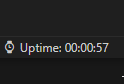

## About

This is my first extension for Visual Studio Code. I created this simple plugin because I could not find it as an already existing one (surprisingly). This is meant to be simple and straightforward, it can be used as bragging rights to your friends or just something to remind you that you need to take a break from your project.

## Features

This extension shows how long you have been on Visual Studio Code. I'm open to any suggestions, just make an issue or message me directly on discord @ rxality#0001 for any insight.

- Run `npm install --only=dev` to install required dependencies for modifying the source code. [Read the docs here.](https://code.visualstudio.com/api)

## Known Issues

- None at this current time.